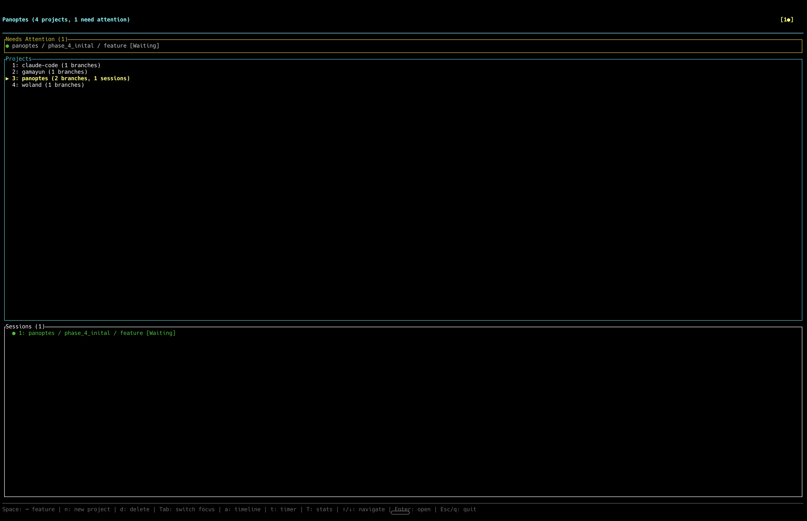

# Panoptes

**Press `Space` to jump to the next session that needs you.**



Running multiple Claude Code sessions across different projects? Panoptes shows them all in one terminal — who's thinking, who's executing, who's waiting for input. Get notified when sessions need attention. Switch instantly with a keystroke.

It's a minimal wrapper, not a new tool to learn. You still use Claude Code exactly as before — Panoptes just makes juggling multiple sessions painless.

Named after the hundred-eyed giant of Greek mythology.

[](LICENSE)
[](https://www.rust-lang.org/)

## Features

- **Multi-Session Management** - Run multiple Claude Code sessions in parallel, each with its own conversation and context
- **Multi-Account Support** - Manage multiple Claude Code accounts and switch between them per-project
- **Permissions Sync** - Automatically copy Claude Code permissions to new worktrees and migrate unique permissions back before deletion
- **Project & Branch Organization** - Sessions organized by git repository and branch. Panoptes automatically creates isolated worktrees so each branch has its own working directory — no manual setup required
- **Real-Time State Tracking** - See what each session is doing: Thinking, Executing, Waiting for input, or Idle
- **Attention System** - Get notified when sessions need your input, with visual badges and terminal bell alerts
- **Activity Timeline** - View all sessions sorted by recent activity across all projects
- **Focus Timer** - Built-in Pomodoro-style focus timer with per-project time tracking
- **Keyboard-Driven Interface** - Fast navigation with vim-style keys and number shortcuts
- **Session Naming** - Name sessions for easy identification ("frontend-auth", "api-refactor")

## Quick Start

### Prerequisites

- [Claude Code CLI](https://claude.ai/code) installed and configured

### Install

```bash
cargo install panoptes-cc
```

Then run:
```bash
panoptes
```

### Build from Source

```bash
git clone https://github.com/ivan-brko/panoptes.git
cd panoptes
cargo build --release
./target/release/panoptes
```

### First Steps

1. Press `a` to add your first project (enter the path to a git repository)
2. Navigate to a project with `Enter`, then to a branch with `Enter`
3. Press `n` to create a new session
4. Enter a name for the session and press `Enter`
5. You're now in Session mode - type to interact with Claude Code
6. Press `Shift+Escape` to exit Session mode
7. Press `Esc` to navigate back through the hierarchy

## Documentation

- **[Installation Guide](docs/INSTALLATION.md)** - Detailed setup instructions
- **[Keyboard Reference](docs/KEYBOARD_REFERENCE.md)** - Complete keyboard shortcut reference
- **[Configuration Guide](docs/CONFIG_GUIDE.md)** - All configuration options explained
- **[Troubleshooting](docs/TROUBLESHOOTING.md)** - Common issues and solutions
- **[Product Overview](docs/PRODUCT.md)** - Detailed feature descriptions
- **[Technical Architecture](docs/TECHNICAL.md)** - How Panoptes works under the hood

## Keyboard Shortcuts

### Essential Navigation

| Key | Action |
|-----|--------|
| `Enter` | Open selected item / Enter session mode |
| `Esc` | Go back / Exit session mode |
| `Shift+Esc` | Quick exit from session mode |
| `Space` | Jump to next session needing attention |
| `Tab` | Switch to next session (in session view) |
| `q` | Quit (with confirmation) |

### Project Management

| Key | Action |
|-----|--------|
| `a` | Add new project |
| `n` | New session / New worktree |
| `d` | Delete selected item |
| `r` | Rename project |
| `R` | Refresh branches |
| `c` | Claude configs (from homepage) / Set project config |

### Views

| Key | Action |
|-----|--------|
| `t` | Start focus timer / Open activity timeline |
| `T` | Open focus statistics |
| `l` | Open log viewer |

See [Keyboard Reference](docs/KEYBOARD_REFERENCE.md) for the complete list.

## Configuration

Configuration is stored in `~/.panoptes/config.toml`:

```toml
hook_port = 9999                # HTTP server port for Claude Code hooks
idle_threshold_secs = 300       # Seconds before session shows attention badge
notification_method = "bell"    # "bell", "title", or "none"
focus_timer_minutes = 25        # Default focus timer duration
```

See [Configuration Guide](docs/CONFIG_GUIDE.md) for all options.

## Session States

| State | Description |
|-------|-------------|
| **Starting** | Session is initializing |
| **Thinking** | Claude is processing your request |
| **Executing** | Claude is running a tool (editing files, running commands) |
| **Waiting** | Claude is waiting for your input |
| **Idle** | No recent activity |
| **Exited** | Session has ended |

## Data Locations

| Path | Purpose |
|------|---------|
| `~/.panoptes/config.toml` | User configuration |
| `~/.panoptes/projects.json` | Projects and branches |
| `~/.panoptes/claude_configs.json` | Claude account configurations |
| `~/.panoptes/focus_sessions.json` | Focus timer history |
| `~/.panoptes/worktrees/` | Git worktrees |
| `~/.panoptes/hooks/` | Hook scripts |
| `~/.panoptes/logs/` | Application logs (7-day retention) |

## Development

```bash
cargo build              # Build debug
cargo build --release    # Build release (with LTO)
cargo test               # Run all tests
cargo clippy             # Lint
cargo fmt                # Format code
```

## License

MIT - see [LICENSE](LICENSE) for details.
