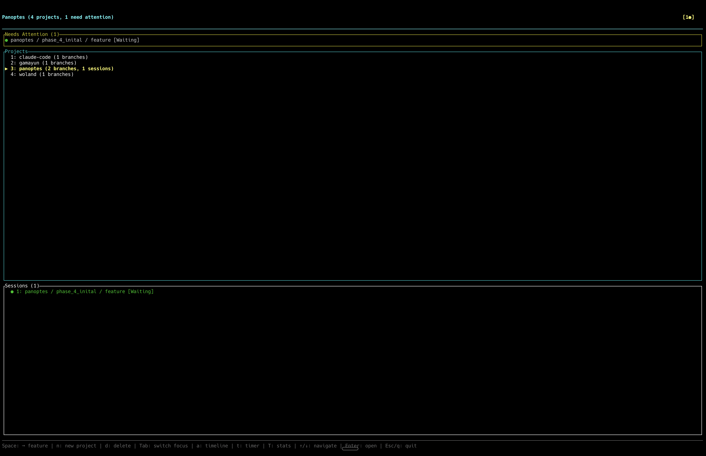

# Panoptes

**Press `Space` to jump to the next session that needs you.**



Running multiple AI coding agents across different projects? Panoptes shows them all in one terminal — who's thinking, who's executing, who's waiting for input. Supports both Claude Code and OpenAI Codex CLI. Get notified when sessions need attention. Switch instantly with a keystroke. You can also run plain shell sessions for tasks like builds or tests, with the same attention tracking so you know when they're done.

It's a minimal wrapper, not a new tool to learn. You still use your AI coding agents exactly as before — Panoptes just makes juggling multiple sessions painless.

Named after the hundred-eyed giant of Greek mythology.

[](LICENSE)
[](https://www.rust-lang.org/)

> **Note:** Panoptes is under active development. Expect breaking changes and rough edges.

## Features

- **Multi-Session Management** - Run multiple Claude Code and Codex sessions in parallel, each with its own conversation and context
- **Multi-Account Support** - Manage multiple accounts for both Claude Code and Codex CLI, switch between them per-project
- **Permissions Sync** - Automatically copy Claude Code permissions to new worktrees and migrate unique permissions back before deletion (Codex planned)
- **Project & Branch Organization** - Sessions organized by git repository and branch. Panoptes automatically creates isolated worktrees so each branch has its own working directory — no manual setup required
- **Project Folders** - Group related projects into folders, nested up to 3 levels. A collapsed folder still shows how many sessions inside it are active or need you
- **Real-Time State Tracking** - See what each session is doing: Thinking, Executing, Waiting for input, or Needs approval
- **Attention System** - Get notified when sessions need your input, with visual badges and terminal bell alerts
- **Keyboard-Driven Interface** - Arrow-key navigation, number shortcuts, and a `?` overlay listing the keys for whichever view you are in
- **Shell Sessions** - Run normal shell sessions alongside Claude Code sessions and get notified when commands finish — useful for running tests, builds, or anything you'd rather not route through Claude, while still benefiting from Panoptes' automatic worktree handling
- **Session Naming** - Name sessions for easy identification ("frontend-auth", "api-refactor")

## Quick Start

### Prerequisites

- [Claude Code CLI](https://claude.ai/code) installed and configured
- (Optional) [OpenAI Codex CLI](https://github.com/openai/codex) installed for Codex session support

### Install

```bash
cargo install panoptes-cc
```

Then run:
```bash
panoptes
```

### Build from Source

```bash
git clone https://github.com/ivan-brko/panoptes.git
cd panoptes
cargo build --release
./target/release/panoptes
```

### First Steps

1. Press `n` to add your first project (enter the path to a git repository)
2. Navigate to a project with `Enter`, then to a branch with `Enter`
3. Press `n` to create a new session — select Claude Code or Codex
4. Enter a name for the session and press `Enter`
5. You're now in Session mode - type to interact with your AI agent
6. Press `Esc` to exit Session mode (use `Shift+Escape` to send an Escape keypress to the agent)
7. Press `Esc` to navigate back through the hierarchy

## Documentation

- **[FAQ](docs/FAQ.md)** - Quick answers to common questions
- **[Installation Guide](docs/INSTALLATION.md)** - Detailed setup instructions
- **[Keyboard Reference](docs/KEYBOARD_REFERENCE.md)** - Complete keyboard shortcut reference
- **[Configuration Guide](docs/CONFIG_GUIDE.md)** - All configuration options explained
- **[Troubleshooting](docs/TROUBLESHOOTING.md)** - Common issues and solutions
- **[Product Overview](docs/PRODUCT.md)** - Detailed feature descriptions
- **[Technical Architecture](docs/TECHNICAL.md)** - How Panoptes works under the hood

## Keyboard Shortcuts

Panoptes shows three panes at once — **Projects**, **Sessions**, **Settings** —
and `Tab` cycles focus. The focused pane widens; the other two shrink but stay
in view.

### Essential Navigation

| Key | Action |
|-----|--------|
| `Tab` / `Shift+Tab` | Switch pane (wraps around) |
| `Enter` | Open selected item / Enter session mode |
| `Esc` | Back one level — never quits, and does nothing at a pane's root |
| `q` | Quit (with confirmation) |
| `Shift+Esc` | Send Escape to the session (from session mode) |
| `Space` | Jump to next session needing attention |
| `?` | Show the keys for wherever you are |

### Project Management

| Key | Action |
|-----|--------|
| `n` | Add new project / New worktree / New session (context-dependent) |
| `s` | New shell session (at a branch) |
| `d` | Delete selected item (ungroups a folder when one is selected) |
| `m` | Move a project or folder into a folder (in the tree) |
| `r` | Rename folder (in the tree) |
| `R` | Refresh git state / branches |
| `,` | Per-project settings: default configs, base branch, rename |

### Settings

Claude accounts, Codex accounts, custom shortcuts, notification toggles, and the
paths of every file Panoptes writes all live in pane 3. Press `Tab` twice.

See [Keyboard Reference](docs/KEYBOARD_REFERENCE.md) for the complete list.

## Multiple Accounts

Need to manage multiple accounts — say, one for work and one for personal projects? Panoptes has you covered.

### Claude Code Accounts
Open Settings (`Tab` twice) → Claude configs to manage them, then assign a per-project default with `,` at the project.

- **New account**: Select any folder as your config directory. Claude will prompt you to log in the first time you use it.
- **Existing account**: Select the Claude config directory you already have (e.g., `~/.claude-work`).

### Codex Accounts
Open Settings (`Tab` twice) → Codex configs to manage them, then assign a per-project default with `,` at the project.

- **New account**: Select any folder as the `CODEX_HOME` directory. Codex will use it for config, auth, and sessions.
- **Existing account**: Select your existing Codex home directory (default `~/.codex`).

> **Note:** Panoptes modifies `CODEX_HOME/config.toml` to install its notify hook. Any existing `notify` configuration will be backed up to `config.toml.panoptes.bak` before overwriting.

## Configuration

Configuration is stored in `~/.panoptes/config.toml`:

```toml
hook_port = 9999                # HTTP server port for Claude Code hooks
notification_method = "bell"    # "bell", "title", or "none"
```

The notification settings can be changed live from Settings → Notifications;
everything else is read at startup. Note that anything the app writes rewrites
the whole file, so hand-written comments in `config.toml` do not survive.

See [Configuration Guide](docs/CONFIG_GUIDE.md) for all options.

## Session States

| State | Description |
|-------|-------------|
| **Starting** | Session is initializing |
| **Thinking** | Agent is processing your request |
| **Executing** | Agent is running a tool (editing files, running commands) |
| **Needs approval** | Agent is asking for permission to proceed |
| **Waiting** | Agent is waiting for your input |
| **Suspended** | Session process suspended after inactivity (wakes on interaction) |
| **Exited** | Session has ended |
| **Resumable** | Session recovered from a previous run and can be resumed |

## Data Locations

| Path | Purpose |
|------|---------|
| `~/.panoptes/config.toml` | User configuration |
| `~/.panoptes/projects.json` | Projects and branches |
| `~/.panoptes/claude_configs.json` | Claude account configurations |
| `~/.panoptes/codex_configs.json` | Codex account configurations |
| `~/.panoptes/worktrees/` | Git worktrees |
| `~/.panoptes/hooks/` | Hook scripts |
| `~/.panoptes/logs/` | Application logs (7-day retention) |

## Development

```bash
cargo build              # Build debug
cargo build --release    # Build release (with LTO)
cargo test               # Run all tests
cargo clippy             # Lint
cargo fmt                # Format code
```

## License

MIT - see [LICENSE](LICENSE) for details.
